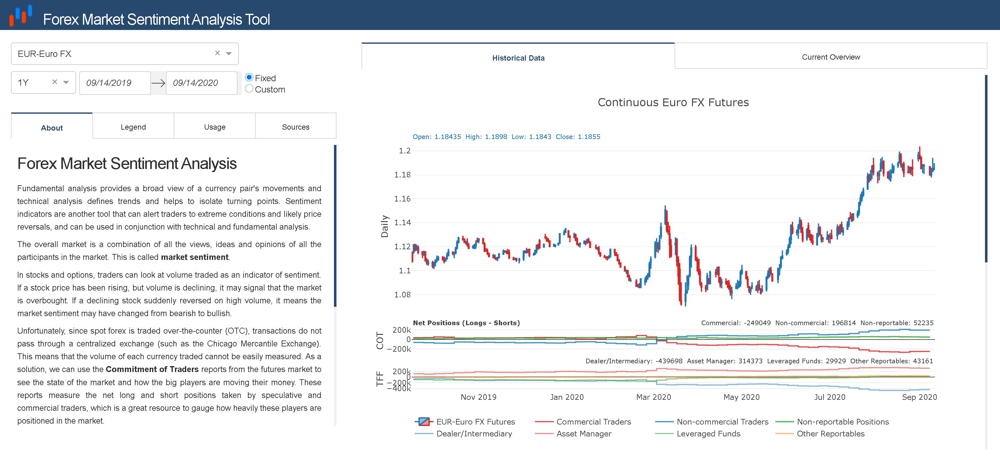
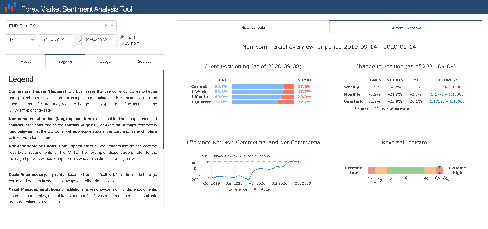
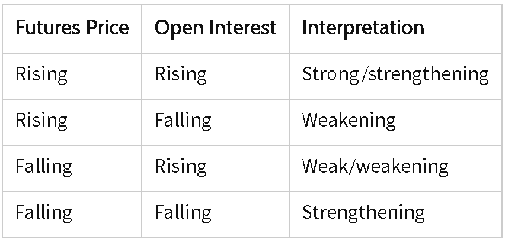

# FX-Market-Sentiment-Analysis

Link to the website: https://leocasanova.pythonanywhere.com/

## About

### Forex Market Sentiment Analysis

Fundamental analysis provides a broad view of a currency pair's movements and technical analysis defines trends and helps to isolate turning points. Sentiment indicators are another tool that can alert traders to extreme conditions and likely price reversals, and can be used in conjunction with technical and fundamental analysis.

The overall market is a combination of all the views, ideas and opinions of all the participants in the market. This is called **market sentiment**.

In stocks and options, traders can look at volume traded as an indicator of sentiment. If a stock price has been rising, but volume is declining, it may signal that the market is overbought. If a declining stock suddenly reversed on high volume, it means the market sentiment may have changed from bearish to bullish.

Unfortunately, since spot forex is traded over-the-counter (OTC), transactions do not pass through a centralized exchange (such as the Chicago Mercantile Exchange). This means that the volume of each currency traded cannot be easily measured. As a solution, we can use the **Commitment of Traders** reports from the futures market to see the state of the market and how the big players are moving their money. These reports measure the net long and short positions taken by speculative and commercial traders, which is a great resource to gauge how heavily these players are positioned in the market.

> The Commodity Futures Trading Commission (CFTC) publishes the Commitment of Traders report (COT) every Friday, around 2:30 pm EST.

This tool is an attempt to understand what the market is feeling—whether the indicators are pointing towards bullish or bearish conditions. Since we can’t tell the market what it should do, we shall come up with appropriate responses to what is happening.

The data is based on positions held as of the preceding Tuesday, which means it is not real-time. Therefore, its usefulness as a market sentiment indicator would be more suitable for longer-term trades.

*Note that using the market sentiment approach doesn’t give a precise entry and exit for each trade but it can help you decide whether to follow the trend or not. Of course, you can always combine market sentiment analysis with technical and fundamental analysis to come up with even better trading strategies.*

## Legend

**Commercial traders (Hedgers):** Big businesses that use currency futures to hedge and protect themselves from exchange rate fluctuation. For example, a large Japanese manufacturer may want to hedge their exposure to fluctuations in the USD/JPY exchange rate.

**Non-commercial traders (Large speculators):** Individual traders, hedge funds and financial institutions trading for speculative gains. For example, a major commodity fund believes that the US Dollar will appreciate against the Euro and, as such, place bets on Euro forex futures.

**Non-reportable positions (Small speculators):** Retail traders that do not meet the reportable requirements of the CFTC. For example, these traders refer to the leveraged players without deep pockets who are shaken out on big moves.

**Dealer/Intermediary:** Typically described as the "sell side" of the market—large banks and dealers in securities, swaps and other derivatives.

**Asset Manager/Institutional:** Institutional investors—pension funds, endowments, insurance companies, mutual funds and portfolio/investment managers whose clients are predominantly institutional.

**Leveraged Funds:** Hedge funds and various types of money managers—registered commodity trading advisors (CTAs), registered commodity pool operators (CPOs) or unregistered funds identified by CFTC.

**Other Reportables:** Traders using markets to hedge business risk, whether that risk is related to foreign exchange, equities or interest rates—corporate treasuries, central banks, smaller banks, mortgage originators, credit unions and any other reportable traders not assigned to the other three categories.

**Longs:** Number of open positions that are buying futures contracts

**Shorts:** Number of open positions that are selling futures contracts

**Open Interests (OI):** Open interest is the total of all futures contracts entered into and not yet offset by a transaction, by delivery, by exercise, etc. The aggregate of all long open interest is equal to the aggregate of all short open interest. Open interest held or controlled by a trader is referred to as that trader's position.

## Usage

### Market Sentiment Indicators

#### Client Positioning & Change in Position

One way to use the COT report for trading is to find extreme net long or net short positions. If the traders hold more long contracts than short contracts, they are bullish. However, if they hold more shorts than longs, they are bearish. When too many speculators are on the same side of the market, there is a high probability of a reversal. For example, assume there are 100 traders trading a currency pair. If 60 of them are long and 40 are short, then 60% of traders are long on the currency pair. When the percentage of trades or traders in one position reaches an extreme level, sentiment indicators become very useful. Assume our aforementioned currency pair continues to rise, and eventually 90 of the 100 traders are long (10 are short). There are very few traders left to keep pushing the trend up. Sentiment indicates it is time to begin watching for a price reversal. When the price moves lower and shows a signal it has topped, the sentiment trader enters short, assuming that those who are long will need to sell in order to avoid further losses as the price falls.

Futures Open Interest can also help gauge sentiment. Open interest (OI), simply defined, is the number of contracts that have not been settled and remain as open positions. If the EUR/USD currency pair is trending higher, looking to open interest in euro futures provides additional insight into the pair. Increasing open interest as the price moves up indicates the trend is likely to continue. Leveling off or declining open interest signals the uptrend could be nearing an end.

The following table shows how open interest is typically interpreted for a futures contract.

The data then must be applied to the forex market. For example, strength in euro futures (US dollar weakness) will likely keep pushing the EUR/USD higher. Weakness in Japanese yen futures (US dollar strength) will likely push the USD/JPY higher.

#### Difference Net Non-Commercial and Net Commercial & Reversal Indicator

Non-Commercials (speculators) and Commercials (hedgers) give opposite signals. While hedgers buy when the market is bottoming, speculators sell as the price moves down. Hedgers are bearish when the market moves to the top while speculators are bullish when the price is climbing.

**Speculators** trade for profit and **are trend followers**.

**Commercials** use futures markets to hedge, and, therefore, **are counter-trend traders**.

If hedgers keep increasing their long positions while speculators increase their short positions, a market bottom could be in sight. If hedgers keep adding more short positions while speculators keep adding more long positions, a market top could occur. Basically, when the spread between commercial hedgers and non-commercial speculators is big, we can expect a market reversal.

This spread is calculated by substracting the net positions of the non-commercial speculators to the net positions of the commercial hedgers.

> **Net Positions = Longs - Shorts**

The Reversal Indicator gives a measure on a scale from -100 to 100 for a given period of the probability that the current spread will turn into a market reversal in comparison to all the spreads of the given period.

It is however difficult to determine the exact point where a sentiment extreme will occur so it is advised not to engage in a position until signs of an actual reversal are seen. Basic rule: every market top or bottom is accompanied by a sentiment extreme, but not every sentiment extreme results in a market top or bottom.

Sentiment indicators are not exact buy or sell signals. Wait for the price to confirm the reversal before acting on sentiment signals. Currencies can stay at extreme levels for long periods of time, and a reversal may not materialize immediately.

Moreover, "extreme levels" will vary from pair to pair. If the price of a currency pair has historically reversed when buying reaches 75%, when the number of longs reaches that level again, it is likely the pair is at an extreme, and you should watch for signs of a price reversal. If another pair has historically reversed when about 85% of traders are short, then you will watch for a reversal at or before this percentage level.

## Sources
> https://www.cftc.gov/MarketReports/CommitmentsofTraders/index.htm

> https://www.babypips.com/

> https://www.barchart.com/

> https://www.investopedia.com/
